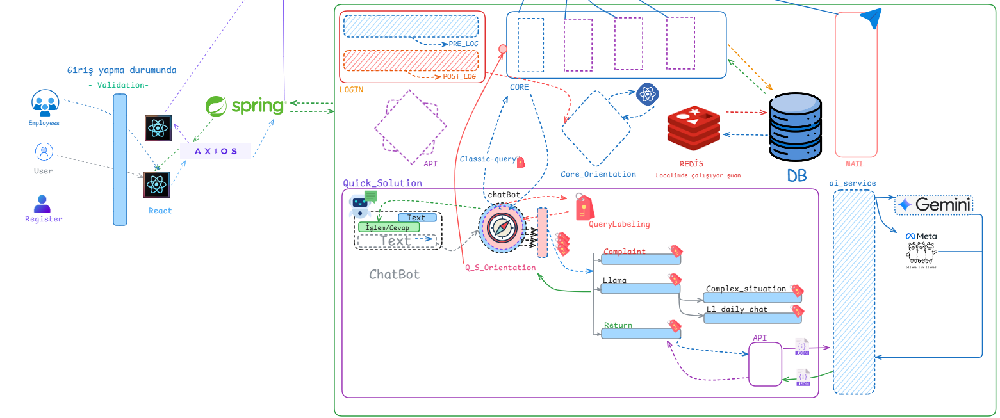

# SupportHub

Bu proje, müşteri destek taleplerini yönetmek için geliştirilmiş bir web uygulamasıdır. Sistem, müşterilerin destek talepleri oluşturmasına, müşteri temsilcilerinin bu talepleri yönetmesine ve yöneticilerin tüm süreci izlemesine olanak tanır.

## Özellikler

- **Müşteri Paneli**: Destek talebi oluşturma, mevcut talepleri görüntüleme ve mesajlaşma
- **Temsilci Paneli**: Destek taleplerini görüntüleme, talepleri üstlenme, müşterilerle mesajlaşma ve talepleri kapatma
- **Yönetici Paneli**: Tüm destek taleplerini izleme, kullanıcı yönetimi ve performans istatistikleri
- **AI Destekli Önceliklendirme**: Llama AI kullanarak destek taleplerini öncelik sırasına göre sınıflandırma (ACİL, YÜKSEK, ORTA, DÜŞÜK)
- **Chatbot Entegrasyonu**: Müşterilere ilk yanıtları vermek için AI destekli chatbot
- **Aktivite Haritası**: GitHub benzeri, temsilcilerin destek aktivitelerini gösteren görsel harita
- **Global ve Local Exception Handling**: Tüm sistemde tutarlı hata yönetimi

## Teknolojiler

### Frontend
- React.js
- Material UI
- React Router
- Axios
- Socket.IO Client (Gerçek zamanlı iletişim)

### Backend
- Spring Boot 3.4.3
- Spring Security (JWT)
- Spring Data JPA
- WebFlux (WebClient ile API entegrasyonu)
- Jakarta EE
- Redis (Caching ve oturum yönetimi)
- MySQL

### AI Servisi
- FastAPI
- Llama 3 (Destek önceliklendirme)
- Gemini API (İçerik validasyonu)
- Ollama (Yerel model çalıştırma)

## Kurulum

### Ön Koşullar
- Node.js (v16+)
- Java 17+
- Maven
- Docker ve Docker Compose
- MySQL
- Redis

### Docker ile Kurulum (Önerilen)
```bash
# Tüm sistemi tek komutla çalıştırma
docker-compose up -d
```

### Manuel Kurulum

#### Backend Kurulumu
```bash
cd backend
mvn clean install
mvn spring-boot:run
```

#### AI Servisi Kurulumu
```bash
cd ai-service
pip install -r requirements.txt
uvicorn app:app --reload
```

#### Frontend Kurulumu
```bash
cd frontend
npm install
npm start
```

## Kullanım

Uygulama başlatıldıktan sonra, tarayıcınızda `http://localhost:3000` adresine giderek uygulamaya erişebilirsiniz.

### Demo Kullanıcılar
- **Admin**: admin@example.com / admin123
- **Temsilci**: rep@example.com / rep123
- **Müşteri**: customer@example.com / customer123

## Sistem Mimarisi



```
┌─────────────┐      ┌─────────────┐      ┌─────────────┐
│   Frontend  │◄────►│   Backend   │◄────►│  Database   │
│  (React.js) │      │(Spring Boot)│      │   (MySQL)   │
└─────────────┘      └─────────────┘      └─────────────┘
                           ▲
                           │
                           ▼
                    ┌─────────────┐      ┌─────────────┐
                    │ AI Service  │◄────►│    Ollama   │
                    │  (FastAPI)  │      │  (Llama 3)  │
                    └─────────────┘      └─────────────┘
                           ▲
                           │
                           ▼
                    ┌─────────────┐      ┌─────────────┐
                    │    Redis    │      │    Gemini   │
                    │  (Caching)  │      │     API     │
                    └─────────────┘      └─────────────┘
```

## Exception Handling

Sistem, global ve local exception handling mekanizmaları ile donatılmıştır:

- **GlobalExceptionHandler**: Tüm genel hataları (kaynak bulunamadı, veri doğrulama, yetkilendirme) merkezi olarak yönetir
- **ApiExceptionHandler**: API servislerinin hatalarını özel olarak ele alır
- **Tutarlı Hata Yanıtları**: Tüm hata yanıtları, timestamp, hata kodu, mesaj ve detay içeren tutarlı bir format kullanır

## Ekran Görüntüleri


## Lisans

Bu proje MIT lisansı altında lisanslanmıştır. Detaylar için [LICENSE](LICENSE) dosyasına bakınız.

# Support Hub Chatbot System

Bu proje, çeşitli e-ticaret markalarına yönelik özelleştirilmiş chatbot arayüzlerini ve backend sistemlerini içerir.

## Sistem Mimarisi

Sistem aşağıdaki ana bileşenlerden oluşmaktadır:

1. **Frontend (React.js)**: Müşteri chatbot arayüzü
2. **Backend (Java Spring Boot)**: Mesaj yönlendirme, işleme ve veri yönetimi
3. **AI Service (Python/Flask)**: Llama AI entegrasyonu ve doğal dil işleme

### Veri Akışı

1. Kullanıcı frontend üzerinden bir mesaj gönderir
2. Mesaj backend'de `ChatBotController` tarafından alınır
3. `ChatBotService` mesajı işler ve etiketleme için `QueryLabeling` servisine gönderir
4. `QueryLabeling` mesajın türünü belirler (iade, şikayet, genel sorgu, vb.)
5. Belirlenen türe göre mesaj ilgili servise yönlendirilir
6. Karmaşık sorgular için Python AI servisi (Llama) kullanılır
7. Kullanıcıya uygun yanıt döndürülür

## Backend Bileşenleri

### ChatBot Paketi

- `ChatBotController.java`: REST API endpoint'lerini yönetir
- `ChatBotService.java`: Mesaj işleme mantığını içerir
- `LlamaConnector.java`: Python AI servisi ile iletişim kurar
- `CModel/ChatMessage.java`: Sohbet mesajı veri modelini tanımlar

### QueryLabeling Servisi

- Mesajları analiz eder ve kategorilere ayırır (DAILY_CHAT, RETURN, COMPLAINT, vb.)
- AI servisi ile entegre çalışır

## AI Service (Python)

- `app.py`: Ana uygulama başlatıcı
- `routes.py`: API endpoint'lerini içerir
- `llama_operations.py`: Llama modeli ile etkileşim sağlar

## Kurulum ve Çalıştırma

### Backend (Java)

```bash
cd backend
./mvnw spring-boot:run
```

### AI Service (Python)

```bash
cd ai-service
pip install -r requirements.txt
python app.py
```

### Frontend (React)

```bash
cd frontend
npm install
npm start
```

## API Endpoint'leri

### ChatBot Controller

- `POST /orientation/route`: Kullanıcı mesajını işler ve yönlendirir
- `POST /orientation/resume`: Oturum bilgisi ile işleme devam eder

### AI Service

- `POST /api/process-query`: Genel sorguları işler
- `POST /api/classify`: Mesajı kategorilere ayırır
- `POST /api/analyze`: Karmaşık mesajları analiz eder
- `POST /api/get-required-info`: Kategori bazlı form bilgilerini döndürür

## Geliştirici Notları

- Backend Java 17 ile geliştirilmiştir
- AI servisi Python 3.9+ gerektirir
- Llama modeli için Ollama sunucusu gereklidir (http://localhost:11434)
- Frontend React 18 ile geliştirilmiştir 
